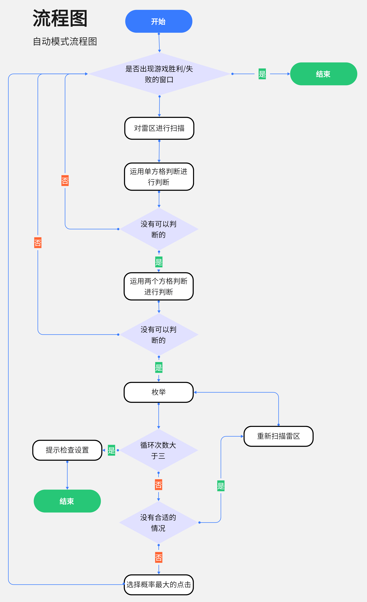

# 扫雷-帮助
————————————————
## 背景
大多数人玩扫雷只会通过一个格子进行判断，或认为扫雷是一个全凭借运气的游戏。但实际上并非如此
懂得判断逻辑帮助你走的更远。

本程序旨在帮助更多的扫雷新手掌握扫雷的基本判断逻辑与方法，在无法判断时，根据概率给出最优的结果。
提高您的胜率，玩的更开心。

## 快速上手
* 解压MineSweeper.zip，获取扫雷游戏
* `pip install -r requirements.txt`

## 成果及程序概述
### 成果
高级扫雷胜率46%

### 概述
`utils.py`核心类`Solver`包含扫雷核心算法

中使用分部分枚举的方法极大地提高了胜率。

* 按照是否有公共的数字方格分组，分组统计可能解，再综合到一起，降低了计算量。
* 仅判断与之有关的数字方格（到要判断的方格的距离小于1.414）进一步提高效率。
* 将相同的情况记录，避免二次计算。

做出图形化界面。并使用qss进行美化。

在点击“帮助”按钮后点击对应方格可以弹出提示。教学扫雷逻辑。

python自带的ctypes十分好用，windows api看[这个链接](https://learn.microsoft.com/zh-cn/windows/win32/api)

#### 自动模式
当人们不想玩的时候，可以让程序自动扫雷。

    

## 可以提高的地方
由于算力及时间的限制，有一些确定的情况无法判断
* 枚举后随机选择权重
