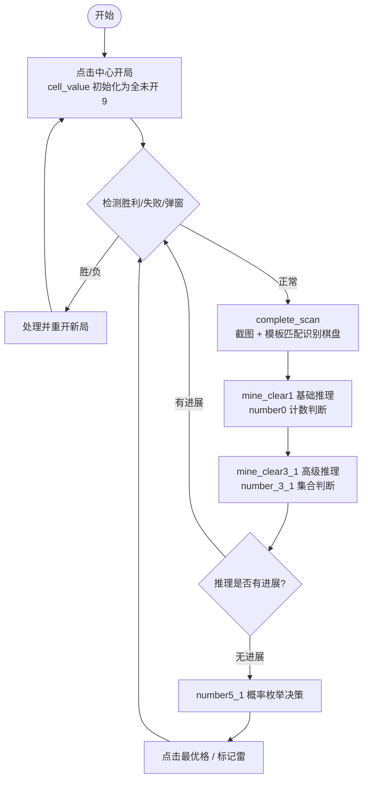
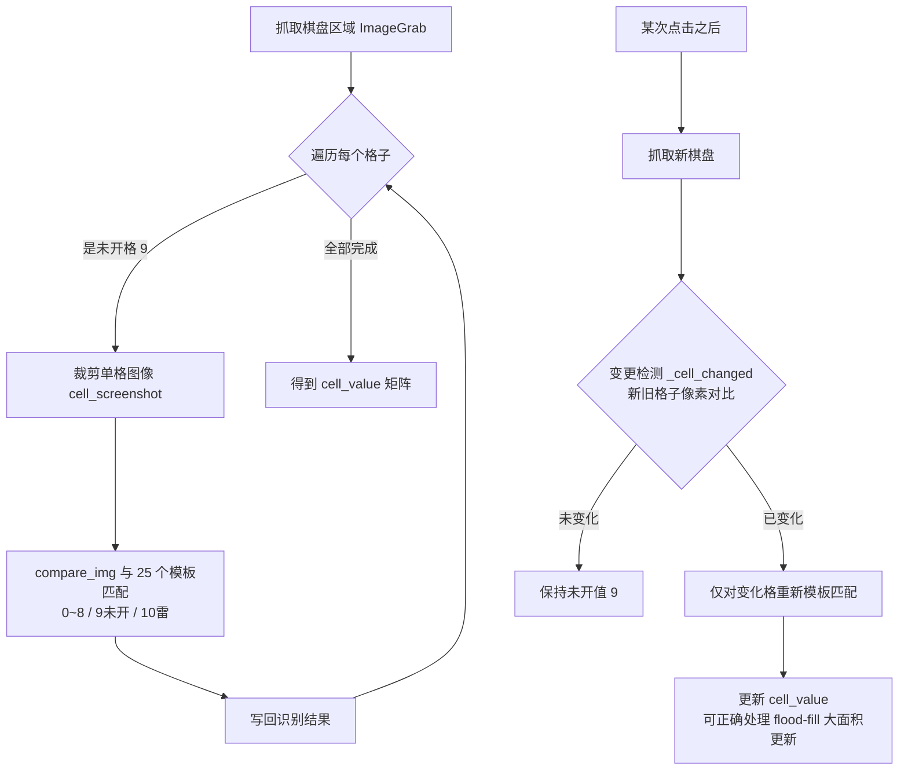
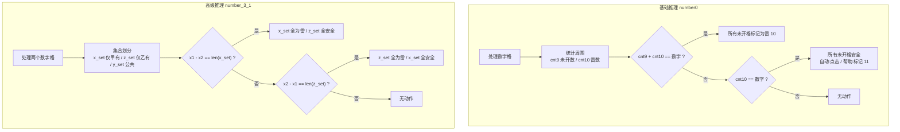
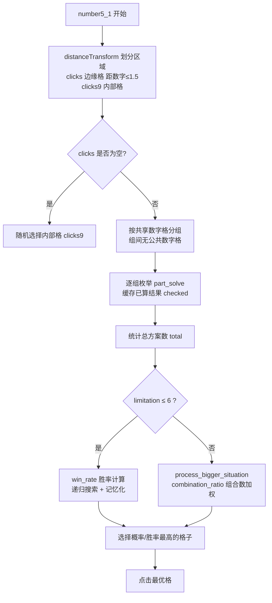

# 智能扫雷助手

一个基于 Python 的智能扫雷助手，帮助玩家学习扫雷策略并提供最优解决方案。

## 项目特点

- 🎯 高级难度胜率达 46%
- 🤖 支持自动模式
- 🎓 内置教学功能
- 🔍 智能提示系统
- 📊 概率分析辅助决策

## 环境要求

- Python 3.7
- Windows 系统

## 快速开始

1. 克隆项目并解压 MineSweeper.zip

2. 安装依赖

## 核心算法

### 求解策略

1. **基础逻辑判断**
   - 数字周围未开格子数量等于数字值时,所有未开格子都是雷
   - 数字周围雷数等于数字值时,其他未开格子可以安全点开

2. **高级推理**
   - 分组枚举:按照共享数字格子将区域分组
   - 概率统计:计算每个未开格子是雷的概率
   - 最优选择:选择最安全且能开启最多格子的位置

3. **优化方法**
   - 缓存相同场景的计算结果
   - 仅计算相关数字格子(距离<1.414的格子)
   - 分部分枚举降低计算复杂度
   - C++ 加速核心(见下文)

## C++ 加速模块（可选）

核心热点（`part_solve` 深度枚举、`win_rate` 胜率搜索、`process_bigger_situation`
乘积组合计算、`part_solve_single`）已用 C++ (pybind11) 重写，位于 `cpp/mscore.cpp`，
构建产物为 `utils/mscore.cp310-win_amd64.pyd`（Python 3.10 / Win64）。

- **自动回退（硬性保证）**：`.pyd` 缺失、Python 版本不匹配、依赖缺失或运行期任何
  异常时，程序自动回退到纯 Python 原实现，功能与结果完全一致（`utils/native.py`
  负责加载与回退开关）。
- **强制禁用**：设置环境变量 `MSW_DISABLE_NATIVE=1` 可强制使用纯 Python（用于对比测试）。
- **决策阈值自适应放宽**：C++ 可用时，按实测提速校准放宽两处按 Python 耗时标定的阈值
  （`part_solve` 组枚举上限 +8（提速 ~424x），win_rate 触发阈值 `limitation <= 6 → 8`
  （提速 ~6x）），同等墙钟时间下搜索更深、结果更优；纯 Python 回退时自动恢复原阈值。
  设 `MSW_NATIVE_TUNE=0` 可强制保持原阈值（新旧实现决策对比时使用）。
- **重新构建**：在仓库根目录执行 `cpp\build.bat`（需要 MSVC 2022 与 py310 环境，
  pybind11 头文件已 vendored 在 `cpp/inc/`）。
- **一致性验证**：`bench/compare_native.py` 在相同输入下逐位对比 C++ 与纯 Python
  的全部输出（含 `number5_1` 端到端，固定随机种子）；`bench/profile_hotspots.py`
  用于性能对比。
- 实测（test_33 局面）：`part_solve` 976ms → 2.3ms（约 420 倍），
  `number5_1` 端到端 7.9s → 0.3s（约 27 倍，剩余耗时为视觉扫描）。

### 关键类和函数

- `Solver`: 核心求解器类
  - `complete_scan()`: 扫描并识别棋盘状态
  - `mine_clear1()`: 基础逻辑判断
  - `mine_clear3_1()`: 高级逻辑推理
  - `number5_1()`: 概率分析与决策
  - `part_solve()`: 分部分枚举求解
  - `rescan_after_click()`: 点击后的局部重扫（变更检测）
  - `combination_ratio()`: 组合数比值（概率加权）

## 算法逻辑示意图

> 下图为求解器核心逻辑的详细流程，使用 Mermaid 绘制。

### 1. 整体主循环

```mermaid
flowchart TD
    Start([开始]) --> Init["点击中心开局<br/>cell_value 初始化为全未开 9"]
    Init --> Detect{"检测胜利/失败/弹窗"}
    Detect -->|"胜/负"| Restart["处理并重开新局"]
    Restart --> Init
    Detect -->|"正常"| Scan["complete_scan<br/>截图 + 模板匹配识别棋盘"]
    Scan --> Basic["mine_clear1 基础推理<br/>number0 计数判断"]
    Basic --> Adv["mine_clear3_1 高级推理<br/>number_3_1 集合判断"]
    Adv --> Prog{"推理是否有进展?"}
    Prog -->|"有进展"| Detect
    Prog -->|"无进展"| Prob["number5_1 概率枚举决策"]
    Prob --> Act["点击最优格 / 标记雷"]
    Act --> Detect
```

### 2. 图像识别与局部重扫

```mermaid
flowchart TD
    A["抓取棋盘区域 ImageGrab"] --> B{"遍历每个格子"}
    B -->|"是未开格 9"| C["裁剪单格图像 cell_screenshot"]
    C --> D["compare_img 与 25 个模板匹配<br/>0~8 / 9未开 / 10雷"]
    D --> E["写回识别结果"]
    E --> B
    B -->|"全部完成"| F["得到 cell_value 矩阵"]

    P["某次点击之后"] --> Q["抓取新棋盘"]
    Q --> R{"变更检测 _cell_changed<br/>新旧格子像素对比"}
    R -->|"未变化"| S["保持未开值 9"]
    R -->|"已变化"| T["仅对变化格重新模板匹配"]
    T --> U["更新 cell_value<br/>可正确处理 flood-fill 大面积更新"]
```

### 3. 基础推理与高级推理

```mermaid
flowchart TD
    subgraph basic["基础推理 number0"]
        N0["处理数字格"] --> C["统计周围<br/>cnt9 未开数 / cnt10 雷数"]
        C --> M1{"cnt9 + cnt10 == 数字 ?"}
        M1 -->|"是"| MM["所有未开格标记为雷 10"]
        M1 -->|"否"| M2{"cnt10 == 数字 ?"}
        M2 -->|"是"| SS["所有未开格安全<br/>自动:点击 / 帮助:标记 11"]
        M2 -->|"否"| NN["无动作"]
    end

    subgraph advanced["高级推理 number_3_1"]
        N31["处理两个数字格"] --> SET["集合划分<br/>x_set 仅甲有 / z_set 仅乙有 / y_set 公共"]
        SET --> D1{"x1 - x2 == len(x_set) ?"}
        D1 -->|"是"| R1["x_set 全为雷 / z_set 全安全"]
        D1 -->|"否"| D2{"x2 - x1 == len(z_set) ?"}
        D2 -->|"是"| R2["z_set 全为雷 / x_set 全安全"]
        D2 -->|"否"| NN2["无动作"]
    end
```

### 4. 概率枚举决策（number5_1）

```mermaid
flowchart TD
    P0["number5_1 开始"] --> P1["distanceTransform 划分区域<br/>clicks 边缘格 距数字≤1.5<br/>clicks9 内部格"]
    P1 --> P2{"clicks 是否为空?"}
    P2 -->|"是"| P3["随机选择内部格 clicks9"]
    P2 -->|"否"| P4["按共享数字格分组<br/>组间无公共数字格"]
    P4 --> P5["逐组枚举 part_solve<br/>缓存已算结果 checked"]
    P5 --> P6["统计总方案数 total"]
    P6 --> P7{"limitation ≤ 6 ?"}
    P7 -->|"是"| P8["win_rate 胜率计算<br/>递归搜索 + 记忆化"]
    P7 -->|"否"| P9["process_bigger_situation<br/>combination_ratio 组合数加权"]
    P8 --> P10["选择概率/胜率最高的格子"]
    P9 --> P10
    P10 --> P11["点击最优格"]
```

## 使用模式

### 自动模式

程序会自动完成整个扫雷过程:

1. 扫描棋盘
2. 分析局势
3. 执行最优决策
4. 重复直到胜利或失败

### 帮助模式

为玩家提供下一步最优选择:

1. 点击"帮助"按钮
2. 程序分析当前局势
3. 显示推荐位置及概率
4. 点击推荐位置查看详细推理过程

## 性能优化

- 使用numpy进行矩阵运算
- 图像识别优化
- 缓存机制
- 分组计算降低复杂度

## 项目结构
.
├── utils/
│ ├── util.py # 核心算法
│ └── mm0.py # Windows API封装
├── image/ # 图像识别资源
├── requirements.txt # 项目依赖
└── README.md

## 待优化

1. 算法复杂度优化
   - 改进枚举策略
   - 优化概率计算
   - 引入机器学习方法

2. 功能扩展
   - 支持更多扫雷变体
   - 添加详细的学习教程
   - 统计分析功能

## 技术栈

- Python 3.7
- PyQt5 (GUI)
- OpenCV (图像识别)
- Numpy (矩阵运算)
- Win32API (窗口操作)

## 参考资料

- [Windows API 文档](https://learn.microsoft.com/zh-cn/windows/win32/api)
- [扫雷算法策略](https://minesweeper.online/help/patterns)

## License

MIT License
